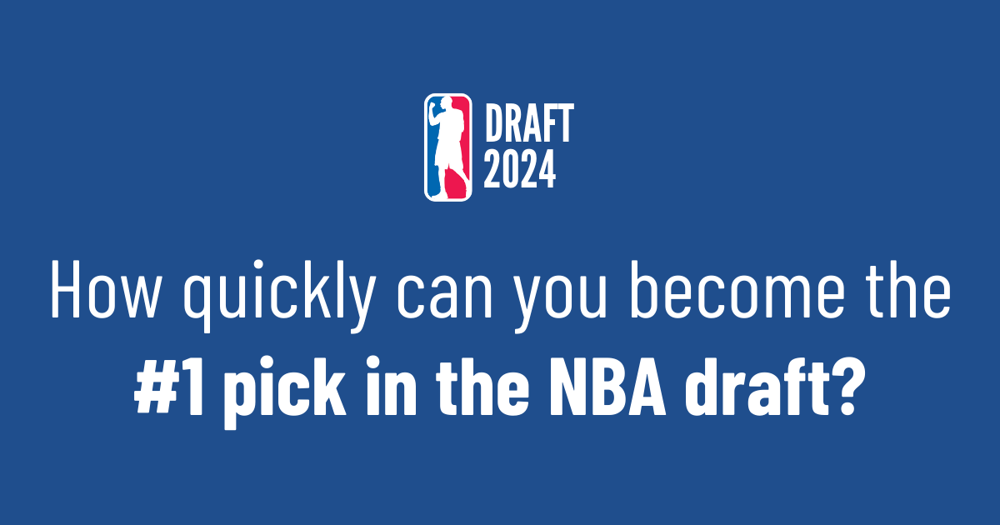

<!-- PROJECT LOGO -->
 

  

<h3 align="center">HoopsToGlory</h3>

  

    HoopsToGlory is a basketball-themed incremental clicker game where your aim is to climb the ranks and secure the number one pick in the NBA draft as quickly as possible, attracting nearly 1,000 users to date. Interconnected gameplay mechanics mean your decisions will have an impact on the game and how quickly you make it to the top.    
     
    <a href="https://github.com/jloizel/hoops-to-glory"><strong>Explore the docs »</strong></a>
     
     
    <a href="https://www.hoopstoglory.com//">View Live Project</a>
    ·
    <a href="https://github.com/jloizel/hoops-to-glory/issues/new?labels=bug&template=bug-report---.md">Leave some feedback</a>
<!--     ·
    <a href="https://www.hoopstoglory.com/issues/new?labels=enhancement&template=feature-request---.md">Request Feature</a> -->
  

<!-- ABOUT THE PROJECT -->
## 📝 About The Project

This project is one of two web games I developed over the past year. After the success of my first project, I wanted to try something different, and creating an incremental game seemed like the perfect challenge. It allowed me to explore new coding concepts and techniques, especially in terms of balancing gameplay mechanics and user engagement.

HoopsToGlory was inspired by my brother's incremental game, <a href="https://notyoutube.dev/">notYoutube.dev</a>, but I aimed to bring my own spin to the genre. My goal was to create a game where every decision impacts the player's progress, combining multiple mechanics to create a more dynamic experience. I also wanted to improve on the user interface by making it cleaner, modern, and easy on the eyes while maintaining simplicity.

While the early game may feel slow at first, the sense of progression grows quickly, rewarding players with a feeling of accomplishment as they rise through the ranks. I believe this gradual improvement is what makes the game fun and addictive.

This project highlights my ability to apply mathematical logic and problem-solving to build interconnected game systems. Though it may look simple on the surface, many complex parameters and calculations work behind the scenes to create a cohesive and engaging player experience.

### Built With (***non-exhaustive***)

<code></code>
<code></code>
<code></code>
<code></code>
<code></code>

 

## 🎮 How to Play

1. Select one of the three skills to train.
2. Recover before being able to train again.
3. Play games once you've reached a high enough average skill level.
4. Choose from a selection of endorsements for each milestone you reach.
5. Try to become the number 1 pick in the draft as quickly as possible and compete with players worldwide!

(<a href="#readme-top">back to top</a>)

